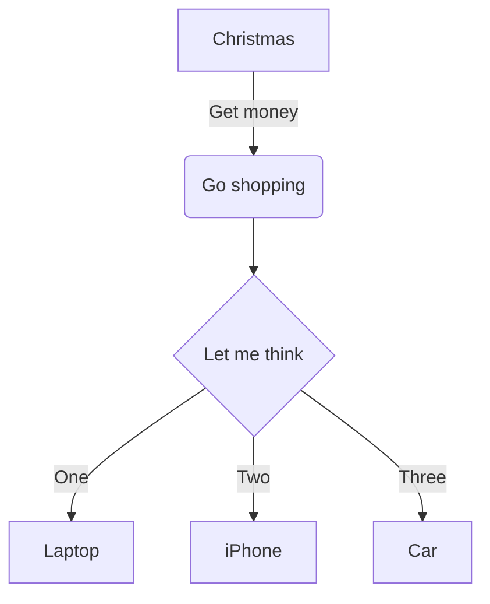

# Titolo paragrafo
## Sottotitolo 1
### Titolo paragrafo
#### Sottotitolo paragrafo

# UTILIZZO MD
il linguaggio di markup (in inglese, markup language) è un insieme di regole che descrivono i meccanismi di rappresentazione di un testo che, utilizzando convenzioni standardizzate, sono utilizzabili su più supporti.

Il linguaggio di markup è un linguaggio formale che utilizza convenzioni standardizzate per la marcatura di un testo in modo da associare significato semantico a porzioni di esso. È spesso utilizzato per la formattazione di documenti testuali in modo da renderli più espressivi e facilmente interpretabili, ma può anche essere utilizzato, come nel caso dell'HTML, per definire la struttura logica di un documento e la sua formattazione.

----

> esempio di quote (citazione)

esempio di __grassetto__ o **bold**

esempio _italic_

esempio di elenco
---

- primo
    - sottoelenco
- terzo
- quarto
- quinto

## esempio di elenco numerato

1. primo
2. secondo
3. terzo
    1. primo
    2. secondo
    3. terzo
        1. primo
        2. secondo
        3. terzo

## esempio check ##
- [x] prova1
- [ ] prova2

## esempio di codice ##
```
git status
git add
git commit
```

```c#
class Program
{
    static void Main(string[] args)
    {
    Console.WriteLine("Hello World!");
    }
}
/*
notte per i collaboratori
*/
```

**esempio di link**

[link a pagina](02_link.md)

[link a pagina](www.google.com)

[link a pagina 3 dentro la sub](/xx-Esercitazioni/02_tipi-di-dati/Program.cs)

[link ad una section del documento](#esempio-di-elenco)

<!-- Commento che non compare nel render markdown -->

| Syntax | Description |
| ------------ | ----------|
| Header | Title |
| Paragraph | ![esempio di SVG di svg repo] |

<font color = "green"> Testo scritto in green!</font>

### Sezioni

<details>
<summery>Tipsfor collapsed sections </summery>

### you can ad a header
you can add text within a collapsed sections.

you can add an image or code block, too.

```ruby
    puts "hello World"
```
</details>

Here is a simple flow chart:

<mark>afasfasfasf</mark>

`sjghsjkdghskjdg`

<mark style="background:green"> sdgsdgs</mark>

## Grafici Mermaid

https://mermaid.js.org/

https://jojozhuang.github.io/tutorial/mermaid-cheat-sheet/

## flowchart basic


