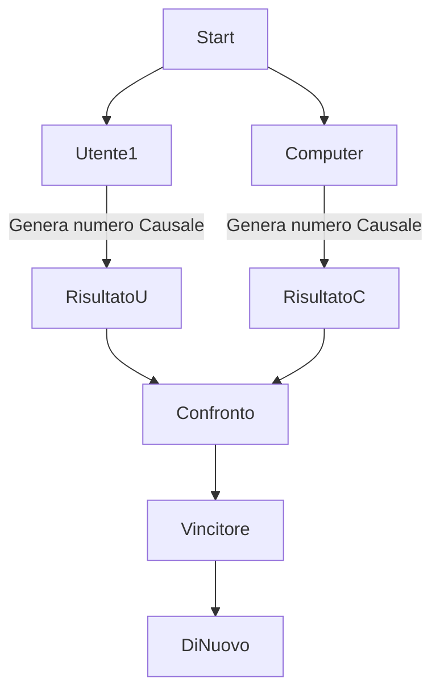

# Gioco di Dadi

## Versione 1

## Obiettivo

- implementare un gioco di dadi umano contro computer
- il giocatore ed il computer lanciano un dado a 6 facce
- il punteggio piu alto vince
- il gioco deve chiedere all'utente se vuole continuare a giocare
- il gioco in questa versione viene realizzato senza funzioni

```csharp
Start:
Random rnd = new Random();
int utenteDado = rnd.Next(1, 7);
Console.WriteLine("Utente lancia il dado...");
Console.ReadLine();

Thread.Sleep(2000);
Console.WriteLine($"Il risultato del lancio è: {utenteDado}");


int computerDado = rnd.Next(1, 7);
Console.WriteLine("Computer lancia il dado...");
Thread.Sleep(2000);
Console.WriteLine($"Il risultato del lancio è: {computerDado}");


if (utenteDado > computerDado)
{
    Console.WriteLine("Utente ha vinto!");
}
else if (utenteDado < computerDado)
{
    Console.WriteLine("Il computer ha vinto!");
}
else
{
    Console.WriteLine("Uguale!");
}

Console.WriteLine("Vuole giocare di nuovo? (s/n)");
string risposta = Console.ReadLine().ToLower();
if (risposta == "s")
{
    goto Start;
}
else
{
    Console.WriteLine("Grazie finita!");
}
```

```bash
git add --all
git commit -m "Gioco di dadi versione 1"
git push -u origin main
```

## Versione 2

## Obiettivo

- 

```csharp


bool giocareDiNuovo = true;

while (giocareDiNuovo)
{
    int utenteDado = UtenteLanciaDado();
    int computerDado = ComputerLanciaDado();
    ControlVinto(utenteDado, computerDado);

    string risposta = ControlGiocareDiNuovo();
    if (risposta == "s")
    {
        giocareDiNuovo = true;
    }
    else
    {
        Console.WriteLine("Grazie finita!");
        break;
    }
    
}

#region funzioni

int UtenteLanciaDado()
{
    Random rnd = new Random();
    int utenteDado = rnd.Next(1, 7);
    Console.WriteLine("Utente lancia il dado...");
    Console.ReadLine();
    Thread.Sleep(2000);
    Console.WriteLine($"Il risultato del lancio è: {utenteDado}");
    return utenteDado;
}

int  ComputerLanciaDado()
{
    Random rnd = new Random();
    int computerDado = rnd.Next(1, 7);
    Console.WriteLine("Computer lancia il dado...");
    Thread.Sleep(2000);
    Console.WriteLine($"Il risultato del lancio è: {computerDado}");
    return computerDado;
}

void ControlVinto (int utenteDado, int computerDado)
{
    if (utenteDado > computerDado)
    {
        Console.WriteLine("Utente ha vinto!");
    }
    else if (utenteDado < computerDado)
    {
        Console.WriteLine("Il computer ha vinto!");
    }
    else
    {
        Console.WriteLine("Uguale!");
    }
}

string ControlGiocareDiNuovo()
{
    Console.WriteLine("Vuole giocare di nuovo? (s/n)");
    string risposta = Console.ReadLine().ToLower();
    return risposta;
}

#endregion
```
```bash
git add --
```

## Versione 2

## Obiettivo
- implementare un sistema di punteggio
- il giocatore ed il computer partono da un punteggio di 100 punti
- al vincitore vengono assegnati 10 punti piu la differenza fra el lancio del dado del giocatore e del computer
- al perdennte vengono sottratti 10 punti piu la differenza fra il lancio del dado del giocatore e del computer
- ad esenpio se il giocatore fa 6 ed il computer fa il 3 giocatore vince e guadagna 10 + 3 andando a 113 punti mentre il computer perde 10 -3 andando a 87 punti.

- al vincitore vengono assegnati 10 punti piu la differenza fra el lancio del dado del giocatore e del computer
- al perdennte vengono sottratti 10 punti piu la differenza fra il lancio del dado del giocatore e del computer


## Grafici Mermaid

https://mermaid.js.org/

https://jojozhuang.github.io/tutorial/mermaid-cheat-sheet/

## flowchart basic Indivina Numero


