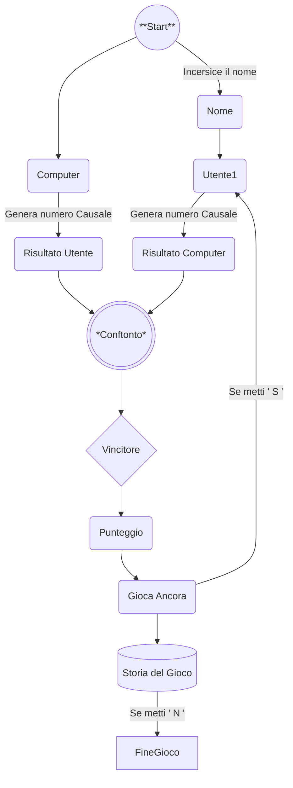

# Gioco di Dadi

## Versione 1

## Obiettivo

- implementare un gioco di dadi umano contro computer
- il giocatore ed il computer lanciano un dado a 6 facce
- il punteggio piu alto vince
- il gioco deve chiedere all'utente se vuole continuare a giocare
- il gioco in questa versione viene realizzato senza funzioni

```csharp
Start:
Random rnd = new Random();
int utenteDado = rnd.Next(1, 7);
Console.WriteLine("Utente lancia il dado...");
Console.ReadLine();

Thread.Sleep(2000);
Console.WriteLine($"Il risultato del lancio è: {utenteDado}");


int computerDado = rnd.Next(1, 7);
Console.WriteLine("Computer lancia il dado...");
Thread.Sleep(2000);
Console.WriteLine($"Il risultato del lancio è: {computerDado}");


if (utenteDado > computerDado)
{
    Console.WriteLine("Utente ha vinto!");
}
else if (utenteDado < computerDado)
{
    Console.WriteLine("Il computer ha vinto!");
}
else
{
    Console.WriteLine("Uguale!");
}

Console.WriteLine("Vuole giocare di nuovo? (s/n)");
string risposta = Console.ReadLine().ToLower();
if (risposta == "s")
{
    goto Start;
}
else
{
    Console.WriteLine("Grazie finita!");
}
```

```bash
git add --all
git commit -m "Gioco di dadi versione 1"
git push -u origin main
```

## Versione 2

## Obiettivo

- Gioco di Dadi con funzioni

```csharp
bool giocareDiNuovo = true;

while (giocareDiNuovo)
{
    int utenteDado = UtenteLanciaDado();
    int computerDado = ComputerLanciaDado();
    ControlVinto(utenteDado, computerDado);

    string risposta = ControlGiocareDiNuovo();
    if (risposta == "s")
    {
        giocareDiNuovo = true;
    }
    else
    {
        Console.WriteLine("Grazie finita!");
        break;
    }
    
}

#region funzioni

int UtenteLanciaDado()
{
    Random rnd = new Random();
    int utenteDado = rnd.Next(1, 7);
    Console.WriteLine("Utente lancia il dado...");
    Console.ReadLine();
    Thread.Sleep(2000);
    Console.WriteLine($"Il risultato del lancio è: {utenteDado}");
    return utenteDado;
}

int  ComputerLanciaDado()
{
    Random rnd = new Random();
    int computerDado = rnd.Next(1, 7);
    Console.WriteLine("Computer lancia il dado...");
    Thread.Sleep(2000);
    Console.WriteLine($"Il risultato del lancio è: {computerDado}");
    return computerDado;
}

void ControlVinto (int utenteDado, int computerDado)
{
    if (utenteDado > computerDado)
    {
        Console.WriteLine("Utente ha vinto!");
    }
    else if (utenteDado < computerDado)
    {
        Console.WriteLine("Il computer ha vinto!");
    }
    else
    {
        Console.WriteLine("Uguale!");
    }
}

string ControlGiocareDiNuovo()
{
    Console.WriteLine("Vuole giocare di nuovo? (s/n)");
    string risposta = Console.ReadLine().ToLower();
    return risposta;
}
#endregion
```
```bash
git add -- all
git commit -m "update_funzionu_versione2"
git push -u origin main
```

## Versione 3

## Obiettivo
- implementare un sistema di punteggio
- il giocatore ed il computer partono da un punteggio di 100 punti
- al vincitore vengono assegnati 10 punti piu la differenza fra el lancio del dado del giocatore e del computer
- al perdennte vengono sottratti 10 punti piu la differenza fra il lancio del dado del giocatore e del computer
- ad esenpio se il giocatore fa 6 ed il computer fa il 3 giocatore vince e guadagna 10 + 3 andando a 113 punti mentre il computer perde 10 -3 andando a 87 punti.

- al vincitore vengono assegnati 10 punti piu la differenza fra el lancio del dado del giocatore e del computer
- al perdennte vengono sottratti 10 punti piu la differenza fra il lancio del dado del giocatore e del computer


```csharp
int punteggioUtente = 100;
int punteggioComputer = 100;

bool continua = true;
Random rnd = new Random();

Console.WriteLine("Insersci il tuo nome");
string nome = Console.ReadLine();
do
{
  int utenteDado = UtenteLanciaDado();

  int computerDado = ComputerLanciaDado();

  int differenza = Math.Abs(utenteDado - computerDado);

  ControloVittoria(utenteDado, computerDado, differenza);

  ControloFineGioco();

  GiocoDiNuovo();

} while (continua);

Console.WriteLine("Fine del gioco, arriverderci!");


#region Funzioni

int UtenteLanciaDado()
{
  int utenteDado = rnd.Next(1, 7);

  Console.WriteLine($"Sig:{nome} tocca un tasto per lanciare il dado");
  Console.ReadKey(true);
  Thread.Sleep(500);
  Console.WriteLine($"Il tuo dado: {utenteDado}");
  return utenteDado;
}

int ComputerLanciaDado()
{
  int computerDado = rnd.Next(1, 7);
  Console.WriteLine("Computer lancia il dado");
  Thread.Sleep(500);
  Console.WriteLine($"Il dado del computer: {computerDado}");
  return computerDado;
}

void ControloVittoria(int utenteDado, int computerDado, int differenza)
{
  if (utenteDado > computerDado)
  {
    punteggioUtente += 10 + differenza;
    punteggioComputer -= 10 + differenza;
    Console.WriteLine("Utente ha vinto!");
  }
  else if (utenteDado < computerDado)
  {
    punteggioComputer += 10 + differenza;
    punteggioUtente -= 10 + differenza;
    
    Console.WriteLine("Il computer ha vinto");
  }
  else
  {
    Console.WriteLine("Uguale!");
  }
  Console.WriteLine($"Punteggio Utente: {punteggioUtente}");
  Console.WriteLine($"Punteggio Computer: {punteggioComputer}");
}

void ControloFineGioco()
{
  if (punteggioUtente <= 0)
  {
    Console.WriteLine("Il computer ha vinto il gioco");
    continua = false;
  }
  else if (punteggioComputer <= 0)
  {
    Console.WriteLine("L'utente ha vinto il gioco");
    continua = false;
  }
}

void GiocoDiNuovo()
{
  Console.WriteLine("Vuole giocare ancora? (s/n)");
  string risposta = Console.ReadLine().ToLower();
  if (risposta == "s")
  {
    Console.WriteLine("continua il gioco");
  }
  else
  {
    Console.WriteLine("Esce dal gioco ...");
    continua = false;
  }
}
#endregion
```

```bash
git add -- all
git commit -m "update punteggio versione3"
git push -u origin main
```

## Versione 4

## obiettivo

- implementare lo strico punteggio
- stampa degli punteggio utente e computer

```csharp

List<int> listaStoriaUtente = new List<int>();
List<int> listaStoriaComputer = new List<int>();

int punteggioUtente = 100;
int punteggioComputer = 100;

bool continua = true;
Random rnd = new Random();

Console.WriteLine("Insersci il tuo nome");
string nome = Console.ReadLine();
do
{
  int utenteDado = UtenteLanciaDado();

  int computerDado = ComputerLanciaDado();

  int differenza = Math.Abs(utenteDado - computerDado);

  ControloVittoria(utenteDado, computerDado, differenza);
  ControloFineGioco();

  GiocoDiNuovo();
} while (continua);

Console.WriteLine("Storia del gioco:");

StampaStoriaUtente();
StampaStoriaComputer();


Console.WriteLine("Fine del gioco, arriverderci!");


#region Funzioni

int UtenteLanciaDado()
{
  int utenteDado = rnd.Next(1, 7);

  Console.WriteLine($"Sig:{nome} tocca un tasto per lanciare il dado");
  Console.ReadKey(true);
  Thread.Sleep(500);
  Console.WriteLine($"Il tuo dado: {utenteDado}");
  listaStoriaUtente.Add(utenteDado);
  return utenteDado;
}

int ComputerLanciaDado()
{
  int computerDado = rnd.Next(1, 7);
  Console.WriteLine("Computer lancia il dado");
  Thread.Sleep(500);
  Console.WriteLine($"Il dado del computer: {computerDado}");
  listaStoriaComputer.Add(computerDado);
  return computerDado;
}

void ControloVittoria(int utenteDado, int computerDado, int differenza)
{
  if (utenteDado > computerDado)
  {
    punteggioUtente += 10 + differenza;
    punteggioComputer -= 10 + differenza;
    Console.WriteLine("Utente ha vinto!");
  }
  else if (utenteDado < computerDado)
  {
    punteggioUtente -= 10 + differenza;
    punteggioComputer += 10 + differenza;
    Console.WriteLine("Il computer ha vinto");
  }
  else
  {
    Console.WriteLine("Uguale!");
  }
  Console.WriteLine($"Punteggio Utente: {punteggioUtente}");
  Console.WriteLine($"Punteggio Computer: {punteggioComputer}");
  listaStoriaUtente.Add(punteggioUtente);
  listaStoriaComputer.Add(punteggioComputer);
}

void ControloFineGioco()
{
  if (punteggioUtente <= 0)
  {
    Console.WriteLine("Il computer ha vinto il gioco");
    continua = false;
  }
  else if (punteggioComputer <= 0)
  {
    Console.WriteLine("L'utente ha vinto il gioco");
    continua = false;
  }
}

void GiocoDiNuovo()
{
  Console.WriteLine("Vuole giocare ancora? (s/n)");
  string risposta = Console.ReadLine().ToLower();
  if (risposta == "s")
  {
    Console.WriteLine("continua il gioco");
  }
  else
  {
    Console.WriteLine("Esce dal gioco ...");
    continua = false;
  }
}

void StampaStoriaUtente()
{
  Console.WriteLine($"Dadi e Punteggi di {nome}:");
 foreach (var dadiUtent in listaStoriaUtente)
 {
    Console.Write($" {dadiUtent}, ");
 }
  Console.WriteLine();
}

void StampaStoriaComputer()
{
  Console.WriteLine("Dadi e Punteggi di Computer:");
 foreach (var dadiComp in listaStoriaComputer)
 {
    Console.Write($" {dadiComp}, ");
 }
  Console.WriteLine();
}

#endregion
```

```bash
git add --all
git commit -m "update history_utente e computer"
git push -u origin main
```


## Grafici Mermaid

https://mermaid.js.org/

https://jojozhuang.github.io/tutorial/mermaid-cheat-sheet/

## flowchart basic Indivina Numero


