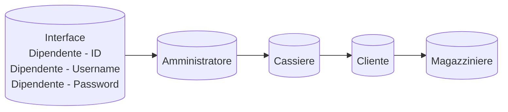
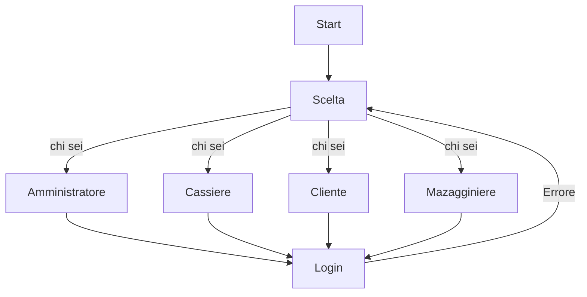

# SUPERMERCATO ADVANCED

Implementare le entita che compongono un supermercato.

---

|Dipendente|Tipo di dato|Note|
|---|---|---|
|ID|Int|viene generato in automatico con un progressivo|
|username|String|viene assegnato dall admin|
|ruolo|String|viene assegnato dall admin e puo essere cassiere o magazziniere|

|Cliente|Tipo di dato|Note|
|---|---|--|
|ID|int|viene generato in automatico con un progressivo|
|username|String|ognuno decide come vuole farlo|
|carrello|Prodotto[]||
|||
|storico_acquisti|Purchases[]|viene popolato al termine di ogni acquisto|
|percentuale_sconto|int|viene incrementata a seconda del valore dello storico degli acquisti|

|Prodotto|Tipo di dato|Note|
|---|---|---|
|ID|int|viene generato in automatico con un progressivo|
|nome|String|viene inserito dal magazziniere|
|prezzo|double|viene inserito dal magazziniere|
|giacenza|int|viene inserito dal magazziniere|


|Categoria|Tipo di dato|Note|
|---|---|---|


**Purchases è lo stato nel quale si trova l acquisto di un cliente. Prima di essere passato alla cassa**

- Quando viene passato allo stato `completato` la cassa puo processare lo scontrino.

|Purchases|Tipo di dato|Note|
|---|---|---|
|ID|int|viene generato in automatico con un progressivo|
|cliente|Cliente||
|prodotti|Prodotto[]|viene inserito dal cliente|
|quantita|int|viene inserita dal cliente|
|data|Date|viene generato in automatico con la data corrente (quando il cliente completa l acquisto)|
|stato|Bool|lo stato di un acquisto di default e `in corso` e puo essere modificato dal cliente in `completato` o `annullato`|

|Cassa|Tipo di dato|Note|
|---|---|---|
|ID|int|viene generato in automatico con un progressivo|
|dipendente|Dipendente|
|acquisti|Purchases[]|
|scontrino_processato|Bool|di default e `false` e diventa `true` quando la cassa ha processato lo scontrino|

**Ruoli (che sarebbe il menu):**

|Cassiere|Magazziniere|Amministratore|Cliente|
|---|---|---|---|
|puo registrare i prodotti acquistati da un cliente che ha degli acquisti in stato completato e calcolare il totale da pagare generando lo scontrino. pou ricaricera credito cliente.|puo visualizzare aggiungere modificare o rimuovere prodotti dal magazzino.|puo visualizzare ed impostare il ruolo dei dipendenti.|Può aggiungere o rimuovere prodotti e cambiare lo stato dell ordine|


> ## Grafica che rappresente il diagramma 

## Grafici Mermaid

https://mermaid.js.org/

https://jojozhuang.github.io/tutorial/mermaid-cheat-sheet/

## flowchart basic Supermercato





> # Documentazione

# Cosa ci serve!
### 1 - Crea una cartella si chiama Models e dentro class quale serve (base)

## Models
- [x] Cassa
- [x] Categoria
- [x] Cliente
- [x] Dipendente
- [x] Prodotto
- [x] Purchases

## Class Cassa
Codice details e visualizzare
<details>
<summery>Class Cassa</summery>

- [x] Id
- [x] Dipendente
- [x] Purchases
- [x] ScontrinoProcessato

```csharp
public class Cassa
{
    private int _Id;
    private Dipendente _dipendente;
    private List<Purchases> _Acquisti;
    private bool _ScontrinoProcessato;

    public int Id
    {
        get
        {
            return _Id;
        }
        set
        {
            _Id = value;
        }
    }
    public Dipendente dipendente { 
        get{
            return dipendente;
        } 
        set{
            dipendente = value;} 
        }
    public List<Purchases> Acquisti
    {
        get
        {
            return _Acquisti;
        }
        set
        {
            _Acquisti = value;
        }
    }
    public bool ScontrinoProcessato
    {
        get
        {
            return _ScontrinoProcessato;
        }
        set
        {
            _ScontrinoProcessato = value;
        }
    }
}
```
</details>

## Class Categoria
Codice Details e visualizzare
<details>
<summery> Class Categoria </summery>

- [x] Id
- [x] Nome

```csharp
public class Categoria
{
    private int _Id;
    private string _Nome;

    public int Id
    {
        get
        {
            return _Id;
        }
        set
        {
            _Id = value;
        }
    }
    public string Nome
    {
        get{
            return _Nome;
        }
        set
        {
            if (string.IsNullOrEmpty(value))
            {
                throw new ArgumentException("Il valore di Nome non può essere vuoto");
            }
            _Nome = value;
        }
    }

}
```
</details>

## Class Cliente
Codice details e visualizzare

<details>

<summery>Class Cliente</summery>

- [x] Id
- [x] UserName
- [x] Carrello
- [x] StoricoAcquisti
- [x] PercantualeSconto
- [x] Credito


```csharp
public class Cliente
{
    private int _Id;
    private string _UserName;
    private List<Prodotto> _Carrello;
    private List<Purchases> _StoricoAcquisti;
    private int _PercantualeSconto;
    private double _Credito;

    public int Id
    {
        get { return _Id; }
        set
        {
            _Id = value;
        }
    }
    public string UserName
    {
        get { return _UserName; }
        set
        {
            if (string.IsNullOrEmpty(value))
            {
                throw new ArgumentException("Il valore di UserName non può essere vuoto");
            }

            _UserName = value;

        }
    }
    public List<Prodotto> Carrello
    {
        get
        {
            return _Carrello;
        }
        set
        {
            _Carrello = value;
        }
    }
    public List<Purchases> StoricoAcquisti
    {
        get
        {
            return _StoricoAcquisti;
        }
        set
        {
            _StoricoAcquisti = value;
        }
    }
    public int PercantualeSconto
    {
        get { return _PercantualeSconto; }
        set
        {
            if (value < 0)
            {
                throw new ArgumentException("Il valore di PercantualeSconto deve essere maggiore di zero");
            }
            _PercantualeSconto = value;
        }
    }
    public double Credito
    {
        get { return _Credito; }
        set
        {
            if (value < 0)
            {
                throw new ArgumentException("Il valore di Credito deve essere maggiore di zero");
            }

            _Credito = value;
        }
    }
}
```
</details>

## Class Dipendente
```csharp
public class Dipendente
{
    private int _Id;
    private string _UserName;
    private string _Ruolo;
    
    public int Id
    {
        get
        {
            return _Id;
        }
        set
        {
            _Id = value;
        }
    }
    public string UserName
    {
        get
        {
            return _UserName;
        }
        set
        {
            if (string.IsNullOrEmpty(value))
            {
                throw new ArgumentException("Il valore di UserName non può essere vuoto");
            }
            _UserName = value;
        }
    }
    public string Ruolo
    {
        get
        {
            return _Ruolo;
        }
        set
        {
            if (string.IsNullOrEmpty(value))
            {
                throw new ArgumentException("Il valore di Ruolo non può essere vuoto");
            }
            _Ruolo = value;
        }
    }
}
```
## Class Prodotto
```csharp
public class Prodotto
{
    private static int ultimoId = 0;
    private int _Id;
    private string _Nome;
    private string _Categoria;
    private double _Prezzo;
    private int _Giacenza;

    public Prodotto()
    {
        Id = GeneraId();
    }

    private static int GeneraId()
    {
        return ++ultimoId;

    }

    public int Id
    {
        get
        {
            return _Id;
        }
        set
        {
            _Id = value;
        }
    }

    public string Nome
    {
        get { return _Nome; }
        set
        {
            if (string.IsNullOrEmpty(value))
            {
                throw new ArgumentException("Il valore di NomeProdotto non può essere vuoto");
            }
            _Nome = value;
        }
    }

    public double Prezzo
    {
        get { return _Prezzo; }
        set
        {
            if (value <= 0)
            {
                throw new ArgumentException("Il valore di PrezzoProdotto deve essere maggiore di zero");
            }
            _Prezzo = value;

        }
    }

    public int Giacenza
    {
        get { return _Giacenza; }
        set
        {
            if (value < 0)
            {
                throw new ArgumentException("Il valore di GiacenzaProdotto non può essere negativo");
            }
            _Giacenza = value;
        }
    }

    public string Categoria
    {
        get { return _Categoria; }
        set
        {
            if (string.IsNullOrEmpty(value))
            {
                throw new ArgumentException("Il valore di DescrizioneProdotto non può essere vuoto");
            }
            _Categoria = value;
        }
    }

}
```
## Class Purchases  

```csharp
public class Purchases
{
    private int _Id;
    private Cliente _Cliente;
    private List<Prodotto> _Prodotti;
    private int _Quantita;
    private DateTime _DataAcquisto;
    private bool _Stato;

    public int Id
    {
        get
        {
            return _Id;
        }
        set
        {
            _Id = value;
        }
    }
    public Cliente Cliente
    {
        get
        {
            return _Cliente;
        }
        set
        {
            _Cliente = value;
        }
    }
    public List<Prodotto> Prodotti
    {
        get
        {
            return _Prodotti;
        }
        set
        {
            _Prodotti = value;
        }
    }
    public int Quantita
    {
        get
        {
            return _Quantita;
        }
        set
        {
            _Quantita = value;
        }
    }
    public DateTime DataAcquisto
    {
        get
        {
            return _DataAcquisto;
        }
        set
        {
            _DataAcquisto = value;
        }
    }
    public bool Stato
    {
        get
        {
            return _Stato;
        }
        set
        {
            _Stato = value;
        }
    }
}
```
# Cosa ci serve!
### 2 - Crea una cartella si chiama Manager e crea qui class ...Manager quale serve

- [x] AmministratoreManager
- [x] CassierManager
- [ ] ClienteManager
- [ ] MagazziniereManager
- [x] ProdottoManager

## Class AmministratoreManager
```csharp
public class AmministratoreManager
{
    private List<Dipendente> dipendenti;
    private DipendenteRipository dipendenteRipository;

    public AmministratoreManager()
    {
        dipendenteRipository = new DipendenteRipository();
        dipendenti = new List<Dipendente>();

    }


    public void VisualizzaDipendenti()
    {
        foreach (var dipendente in dipendenti)
        {
            Console.WriteLine($"ID:{dipendente.Id} Nome:{dipendente.UserName} Ruolo:{dipendente.Ruolo}");
        }
    }

    public Dipendente TrovaDipendente(string userName)
    {
        foreach (var item in dipendenti)
        {
            if (item.UserName == userName)
            {
               return item;
            }   
        }
        return null;
    }

    public void ImpostaRuoloDipendente(string userName)
    {
        var dipendente = TrovaDipendente(userName);
        if (dipendente != null)
        {
            string ruolo = InputManager.LeggiStringa("Ruolo: ");
            dipendente.Ruolo = ruolo;
        }
    }


    
}
```
## Class CassiereManager
```csharp
public class CassiereManager
{
    private List<Purchases> _Acquisti;
    private List<Cliente> _Clienti;
    private double totale;

    public CassiereManager(List<Purchases> acquisti, List<Cliente> clienti)
    {
        _Acquisti = acquisti;
        _Clienti = clienti;
    }

    public void RegistraAcquisto(Cliente cliente)
    {
        if (cliente.StoricoAcquisti.Count > 0)
        {
            foreach (var acquisto in cliente.StoricoAcquisti)
            {
                if (acquisto.Stato == true)
                {
                    _Acquisti.Add(acquisto);
                }
            }
        }
    }

    public void CalcolaTotale()
    {
        foreach (var acquisto in _Acquisti)
        {
            double sommaPrd = 0;
            foreach (var prodotto in acquisto.Prodotti)
            {
                sommaPrd += prodotto.Prezzo;
            }
            totale += sommaPrd;
            // _Totale += acquisto.Prodotti.Sum(x => x.Prezzo); lambda expression
        }
        Console.WriteLine($"Totale: {totale}");
    }

    public void GeneraScontrino()
    {        //Metto scontrino che abbiamo già fatto prima....
        Console.WriteLine("Scontrino:");
        foreach (var acquisto in _Acquisti)
        {
            Console.WriteLine($"Cliente: {acquisto.Cliente.UserName} Data: {acquisto.DataAcquisto}");
            Console.WriteLine("Prodotti:");
            foreach (var prodotto in acquisto.Prodotti)
            {
                Console.WriteLine($"Nome: {prodotto.Nome} Prezzo: {prodotto.Prezzo}");
            }
            Console.WriteLine($"Totale: {totale}");
        }
    }

}
```
## Class ClienteManager
```csharp
public class ClienteManager
{
    private ProdottoRepository prodottoRepository;
    private ClienteRipository clienteRepository;
    private List<Purchases> storicoAcquisti;
    private List<Prodotto> carrello;
    private int prossimoId;

    public ClienteManager()
    {
        prodottoRepository = new ProdottoRepository();
        clienteRepository = new ClienteRipository();
        carrello = new List<Prodotto>();
        storicoAcquisti = new List<Purchases>();
        prossimoId = 1;
    }
    public void AggiungiProdotto(Prodotto prodotto)
    {
        carrello.Add(prodotto);
    }

    public void RimuoviProdotto(Prodotto prodotto)
    {
        carrello.Remove(prodotto);
    }

    public void CambiaStatoOrdine(Purchases ordine, bool stato)
    {
        ordine.Stato = stato;
    }

}
```
## Class MagazziniereManager
```csharp
public class MagazziniereManager
{
    private ProdottoRepository prodottoRepository;
    private List<Prodotto> magazzino;

    public MagazziniereManager()
    {
        prodottoRepository = new ProdottoRepository();
        magazzino = new List<Prodotto>();
    }
    
    public void AggiungiProdotto(Prodotto prodotto)
    {
        magazzino.Add(prodotto);
    }

    public void RimuoviProdotto(Prodotto prodotto)
    {
        magazzino.Remove(prodotto);
    }

    public void ModificaProdotto(Prodotto prodotto)
    {
        magazzino.Add(prodotto);
    }

    public void VisualizzaProdotti()
    {
        foreach (var prodotto in magazzino)
        {
            Console.WriteLine(prodotto);
        }
    }
}
```
## Class ProdottoManager
```csharp
public class ProdottoManager
{
  private ProdottoRepository repository;
  private int prossimoId;
  private List<Prodotto> prodotti; // prodotti e private perchè non voglio che vengano modificati dall'esterno

  public ProdottoManager(List<Prodotto> prodotti)
  {
    this.prodotti = prodotti;
    repository = new ProdottoRepository();
    prossimoId = 1;
    foreach (var prodotto in prodotti)
    {
      if (prodotto.Id >= prossimoId)
      {
        prossimoId = prodotto.Id + 1;
      }
    }
  }

  public void AggiungiProdotto(Prodotto prodotto)
  {
    prodotto.Id = prossimoId;
    prossimoId++;
    prodotti.Add(prodotto);
  }
  // metodo per visualizzare tutti i prodotti
  public List<Prodotto> OttieniProdotti()
  {
    return prodotti;
  }
  
  public void StampaProdottoIncolonnati ()
  {
    // intestazione con larghezza fissa
    Console.WriteLine($"{"ID", -5} {"Nome", -20} {"Prezzo", -10} {"Giacenza", -10} {"Categoria", -20}");
    
    Console.WriteLine(new string('-', 50)); // Linea separatrice
    
    // stampa ogni prodotto cn larghezza fissa
    foreach (var prodotto in prodotti)
    {
      Console.WriteLine($"{prodotto.Id, -5} {prodotto.Nome, -20} {prodotto.Prezzo, -10} {prodotto.Giacenza, -10} {prodotto.Categoria, -20}");
    }
  }

  public Prodotto TrovaProdotto(int id)
  {
    foreach (var prodotto in prodotti)
    {
      if (prodotto.Id == id)
      {
        return prodotto;
      }
    }
    return null;
  }
  // metodo per modificare un prodotto esistente
  public void AggiornaProdotto(int id, Prodotto nuovoProdotto)
  {
    var prodotto = TrovaProdotto(id);
    if (prodotto != null)
    {
      prodotto.Nome = nuovoProdotto.Nome;
      prodotto.Prezzo = nuovoProdotto.Prezzo;
      prodotto.Giacenza = nuovoProdotto.Giacenza;
      prodotto.Categoria = nuovoProdotto.Categoria;
    }
  }
  // metodo per eliminare un prodotto
  public void EliminaProdotto(int id)
  {
    var prodotto = TrovaProdotto(id);
    if (prodotto != null)
    {
      prodotti.Remove(prodotto);
      File.Delete($@"Database/Prodotti/{prodotto.Id}.json");
    }
  }
}
```

# Cosa ci serve!
### 3 - Crea una cartella si chiama Repository e crea qui class ...Repository quale serve
> dotnet add package Newtonsoft.Json;

- [x] CassaRepository
- [x] CategoriaRepository
- [x] ClienteRepository
- [x] DipendenteRepository
- [x] ProdottoRepository
- [x] PurchasesRepository

## Class CassaRepository
```csharp
using Newtonsoft.Json;
public class CassaRepository
{
  private readonly string folderPath = @"Database/Cassa";

  public void SalvaCassa(List<Cassa> cassa)
  {
    if (!Directory.Exists(folderPath))
    {
      Directory.CreateDirectory(folderPath);
    }

    foreach (var cas in cassa)
    {
      string filePath = $"{folderPath}/{cas.Id}.json";
      // Serialize file
      string jsonData = JsonConvert.SerializeObject(cas, Formatting.Indented);
      // Write
      File.WriteAllText(filePath, jsonData);
      // Console.WriteLine($"salvati {filePath}");
    }
  }

  public List<Cassa> CaricaCassa()
  {
    List<Cassa> cassa = new List<Cassa>();

    // control
    if (Directory.Exists(folderPath))
    {
      string[] filePaths = Directory.GetFiles(folderPath, "*.json");

      foreach (var item in filePaths)
      {
        // Read fatoo
        string jsonData = File.ReadAllText(item);
        // Deserialize
        Cassa cas = JsonConvert.DeserializeObject<Cassa>(jsonData);
        cassa.Add(cas);
        // Console.WriteLine($" caricati {item}");
      }
      // foreach (var cas in cassa)
      // {
      //     Console.WriteLine($"Id: {cas.Id}, Nome: {cas.Nome}, Prezzo: {cas.Prezzo}, Giacenza: {cas.Giacenza}, Categoria: {cas.Categoria}");
      // }
    }
    else
    {
      Console.WriteLine($"Cartella {folderPath} non esiste");
    }

    return cassa;
  }

  public void RimuoviDaCassa(int id)
  {
    string filePath = $"{folderPath}/{id}.json";
    if (File.Exists(filePath))
    {
      File.Delete(filePath);
    }
  }
}
```
## Class CategoriaRepository
```csharp
using Newtonsoft.Json;
public class CategoriaRepository
{
  private readonly string folderPath = @"Database/Categoria";

  public void SalvaCategoria(List<Categoria> categoria)
  {
    if (!Directory.Exists(folderPath))
    {
      Directory.CreateDirectory(folderPath);
    }

    foreach (var cat in categoria)
    {
      string filePath = $"{folderPath}/{cat.Id}.json";
      // Serialize file
      string jsonData = JsonConvert.SerializeObject(cat, Formatting.Indented);
      // Write
      File.WriteAllText(filePath, jsonData);
      // Console.WriteLine($"salvati {filePath}");
    }
  }

  public List<Categoria> CaricaCategoria()
  {
    List<Categoria> categoria = new List<Categoria>();

    // control
    if (Directory.Exists(folderPath))
    {
      string[] filePaths = Directory.GetFiles(folderPath, "*.json");

      foreach (var item in filePaths)
      {
        // Read fatoo
        string jsonData = File.ReadAllText(item);
        // Deserialize
        Categoria cat = JsonConvert.DeserializeObject<Categoria>(jsonData);
        categoria.Add(cat);
        // Console.WriteLine($" caricati {item}");
      }
      // foreach (var cat in categoria)
      // {
      //     Console.WriteLine($"Id: {cat.Id}, Nome: {cat.Nome}, Prezzo: {cat.Prezzo}, Giacenza: {cat.Giacenza}, Categoria: {cat.Categoria}");
      // }
    }
    else
    {
      Console.WriteLine($"Cartella {folderPath} non esiste");
    }

    return categoria;
  }

  public void RimuoviDaCategoria(int id)
  {
    string filePath = $"{folderPath}/{id}.json";
    if (File.Exists(filePath))
    {
      File.Delete(filePath);
    }
  }

}
```
## Class ClienteRepository
```csharp
using Newtonsoft.Json;
public class ClienteRepository
{
  private readonly string folderPath = @"Database/Carrello";

  public void SalvaCarrello(List<Prodotto> carrello)
  {
    if (!Directory.Exists(folderPath))
    {
      Directory.CreateDirectory(folderPath);
    }

    foreach (var prodotto in carrello)
    {
      string filePath = $"{folderPath}/{prodotto.Id}.json";
      // Serialize file
      string jsonData = JsonConvert.SerializeObject(prodotto, Formatting.Indented);
      // Write
      File.WriteAllText(filePath, jsonData);
      // Console.WriteLine($"salvati {filePath}");
    }
  }

  public List<Prodotto> CaricaCarrello()
  {
    List<Prodotto> carrello = new List<Prodotto>();

    // control
    if (Directory.Exists(folderPath))
    {
      string[] filePaths = Directory.GetFiles(folderPath, "*.json");

      foreach (var item in filePaths)
      {
        // Read fatoo
        string jsonData = File.ReadAllText(item);
        // Deserialize
        Prodotto prodotto = JsonConvert.DeserializeObject<Prodotto>(jsonData);
        carrello.Add(prodotto);
        // Console.WriteLine($" caricati {item}");
      }
      // foreach (var prodotto in carrello)
      // {
      //     Console.WriteLine($"Id: {prodotto.Id}, Nome: {prodotto.Nome}, Prezzo: {prodotto.Prezzo}, Giacenza: {prodotto.Giacenza}, Categoria: {prodotto.Categoria}");
      // }
    }
    else
    {
      Console.WriteLine($"Cartella {folderPath} non esiste");
    }

    return carrello;
  }

  public void RimuoviDaCarrello(int id)
  {
    string filePath = $"{folderPath}/{id}.json";
    if (File.Exists(filePath))
    {
      File.Delete(filePath);
      Console.WriteLine($"Prodotto con id {id} rimosso");
    }
    else
    {
      Console.WriteLine($"Prodotto con id {id} non trovato");
    }
  }

}
```
## Class DipendenteRepository
```csharp
using Newtonsoft.Json;
public class DipendenteRipository
{
  private readonly string folderPath = @"Database/Dipendente";

  public void SalvaDipendente(List<Dipendente> dipendente)
  {
    if (!Directory.Exists(folderPath))
    {
      Directory.CreateDirectory(folderPath);
    }

    foreach (var dip in dipendente)
    {
      string filePath = $"{folderPath}/{dip.Id}.json";
      // Serialize file
      string jsonData = JsonConvert.SerializeObject(dip, Formatting.Indented);
      // Write
      File.WriteAllText(filePath, jsonData);
      // Console.WriteLine($"salvati {filePath}");
    }
  }

  public List<Dipendente> CaricaDipendente()
  {
    List<Dipendente> dipendente = new List<Dipendente>();

    // control
    if (Directory.Exists(folderPath))
    {
      string[] filePaths = Directory.GetFiles(folderPath, "*.json");

      foreach (var item in filePaths)
      {
        // Read fatoo
        string jsonData = File.ReadAllText(item);
        // Deserialize
        Dipendente dip = JsonConvert.DeserializeObject<Dipendente>(jsonData);
        dipendente.Add(dip);
        // Console.WriteLine($" caricati {item}");
      }
      // foreach (var dip in dipendente)
      // {
      //     Console.WriteLine($"Id: {dip.Id}, Nome: {dip.Nome}, Prezzo: {dip.Prezzo}, Giacenza: {dip.Giacenza}, Categoria: {dip.Categoria}");
      // }
    }
    else
    {
      Console.WriteLine($"Cartella {folderPath} non esiste");
    }

    return dipendente;
  }

  public void RimuoviDaDipendente(int id)
  {
    string filePath = $"{folderPath}/{id}.json";
    if (File.Exists(filePath))
    {
      File.Delete(filePath);
    }
  }

}
```
## Class ProdottoRepository
```csharp
using Newtonsoft.Json;
public class ProdottoRepository
{
    private readonly string folderPath = "Database/Prodotti";

    public void SalvaProdotti(List<Prodotto> prodotti)
    {
        if (!Directory.Exists(folderPath))
        {
            Directory.CreateDirectory(folderPath);
        }

        foreach (var prodotto in prodotti)
        {
            string filePath = $"{folderPath}/{prodotto.Id}.json";
            // Serialize fle
            string jsonData = JsonConvert.SerializeObject(prodotto, Formatting.Indented);
            // scrivo
            File.WriteAllText(filePath, jsonData);
            // Console.WriteLine($"salvati {filePath}");
        }
    }

    public List<Prodotto> CaricaProdotti()
    {
        List<Prodotto> prodotti = new List<Prodotto>();

        // control
        if (Directory.Exists(folderPath))
        {
            string[] filePaths = Directory.GetFiles(folderPath, "*.json");

            foreach (var item in filePaths)
            {
                // Read fatoo
                string jsonData = File.ReadAllText(item);
                // Deserialize
                Prodotto prodotto = JsonConvert.DeserializeObject<Prodotto>(jsonData);
                prodotti.Add(prodotto);
                // Console.WriteLine($" caricati {item}");
            }
            // foreach (var prodotto in prodotti)
            // {
            //     Console.WriteLine($"Id: {prodotto.Id}, Nome: {prodotto.Nome}, Prezzo: {prodotto.Prezzo}, Giacenza: {prodotto.Giacenza}, Categoria: {prodotto.Categoria}");
            // }
        }
        else
        {
            Console.WriteLine($"Cartell {folderPath} non esiste");
        }

        return prodotti;
    }

    public void RimuoviProdotto(int id)
    {
        string filePath = $"{folderPath}/{id}.json";
        if (File.Exists(filePath))
        {
            File.Delete(filePath);
            Console.WriteLine($"Cancellato {filePath}");
        }
        else
        {
            Console.WriteLine($"File {filePath} non esiste");
        }
    }

}
```
## Class PurchasesRepository
```csharp
using Newtonsoft.Json;
public class PurchasesRepository
{
  private readonly string folderPath = @"Database/Purchases";

  public void SalvaPurchases(List<Purchases> purchases)
  {
    if (!Directory.Exists(folderPath))
    {
      Directory.CreateDirectory(folderPath);
    }

    foreach (var purchase in purchases)
    {
      string filePath = $"{folderPath}/{purchase.Id}.json";
      // Serialize file
      string jsonData = JsonConvert.SerializeObject(purchase, Formatting.Indented);
      // Write
      File.WriteAllText(filePath, jsonData);
      // Console.WriteLine($"salvati {filePath}");
    }
  }

  public List<Purchases> CaricaPurchases()
  {
    List<Purchases> purchases = new List<Purchases>();

    // control
    if (Directory.Exists(folderPath))
    {
      string[] filePaths = Directory.GetFiles(folderPath, "*.json");

      foreach (var item in filePaths)
      {
        // Read fatoo
        string jsonData = File.ReadAllText(item);
        // Deserialize
        Purchases purchase = JsonConvert.DeserializeObject<Purchases>(jsonData);
        purchases.Add(purchase);
        // Console.WriteLine($" caricati {item}");
      }
      // foreach (var purchase in purchases)
      // {
      //     Console.WriteLine($"Id: {purchase.Id}, Nome: {purchase.Nome}, Prezzo: {purchase.Prezzo}, Giacenza: {purchase.Giacenza}, Categoria: {purchase.Categoria}");
      // }
    }
    else
    {
      Console.WriteLine($"Cartella {folderPath} non esiste");
    }

    return purchases;
  }

  public void RimuoviDaPurchases(int id)
  {
    string filePath = $"{folderPath}/{id}.json";
    if (File.Exists(filePath))
    {
      File.Delete(filePath);
    }
    else
    {
      Console.WriteLine("Errore: file non trovato");
    }
  }
}
```

# Cosa ci serve!
### 4 - Crea una cartella si chiama Utilities e crea qui class quale serve

- [x] InputManager
- [x] Ruolo

## Class InputManager
```csharp
public class InputManager
{
    public static int LeggiIntero(string messaggio, int min = int.MinValue, int max = int.MaxValue)
    {
        int valore;
        while (true)
        {
            Console.WriteLine($"{messaggio}");
            string input = Console.ReadLine();

            if (int.TryParse(input, out valore) && valore >= min && valore <= max)
            {
                return valore;
            }
            else
            {
                Console.WriteLine($"inserice un valore intero compreso tra {min} e {max}."); // messahio di errore
            }
        }
    }

    public static double LeggiDouble(string messaggio, double min = double.MinValue, double max = double.MaxValue)
    {
        double valore;
        while (true)
        {
            Console.WriteLine($"{messaggio}");
            string input = Console.ReadLine();

            if (double.TryParse(input, out valore) && valore >= min && valore <= max)
            {
                return valore;
            }
            else
            {
                Console.WriteLine($"inserice un valore double compreso tra {min} e {max}."); // messahio di errore
            }
        }
    }

    public static decimal LeggiDecimale(string messaggio, decimal min = decimal.MinValue, decimal max = decimal.MaxValue)
    {
        decimal valore;
        while (true)
        {
            Console.WriteLine($"{messaggio}");
            string input = Console.ReadLine();

            if (input.Contains("."))
            {
                input = input.Replace(".", ",");
            }

            if (decimal.TryParse(input, out valore) && valore >= min && valore <= max)
            {
                return valore;
            }
            else
            {
                Console.WriteLine($"Inserisci un valore decimale compreso tra {min} e {max}.");
            }
        }
    }

    public static string LeggiStringa(string messaggio, bool obbligatorio = true)
    {
        while (true)
        {
            Console.WriteLine($"{messaggio}");
            string input = Console.ReadLine();
            if (!string.IsNullOrWhiteSpace(input) || !obbligatorio)
            {
                return input;
            }
            else
            {
                Console.WriteLine("Il valore non può essere vuoto. Riprova.");
            }
        }
    }

    public static bool LeggiConferma(string messaggio)
    {
        while (true)
        {
            Console.WriteLine($"{messaggio} (s/n)");
            string input = Console.ReadLine().ToLower();
            if (input == "s" || input == "si")
            {
                return true;
            }
            if (input == "n" || input == "no")
            {
                return false;
            }
            Console.WriteLine("Errore: Rispondere 's' o 'n'.");
        }
    }
}
```
## Class Ruolo
```csharp
public class Ruolo
{
    public const string Magazziniere = "Magazziniere";
    public const string Amministratore = "Amministratore";
    public const string Cassiere = "Cassiere";
    public const string Cliente = "Cliente";

    // Magazziniere: puo visualizzare aggiungere modificare o rimuovere prodotti dal magazzino e può gestire le categorie.
    public static bool IsMagazziniere(string ruole) => ruole == Magazziniere;

    //Amministratore: puo visualizzare ed impostare il ruolo dei dipendenti.
    public static bool IsAmministratore(string ruole) => ruole == Amministratore;

    //Cassiere: puo registrare i prodotti acquistati da un cliente che ha degli acquisti in stato completato e calcolare il totale da pagare generando lo scontrino,e può ricaricare il credito del cliente quando è finito.
    public static bool IsCassiere(string ruole) => ruole == Cassiere;
    
    // Cliente: Può aggiungere o rimuovere prodotti e cambiare lo stato dell ordine
    public static bool IsCliente(string ruole) => ruole == Cliente;
    
}
```
